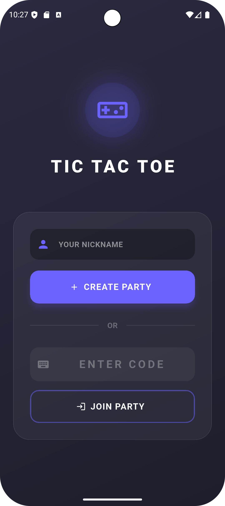
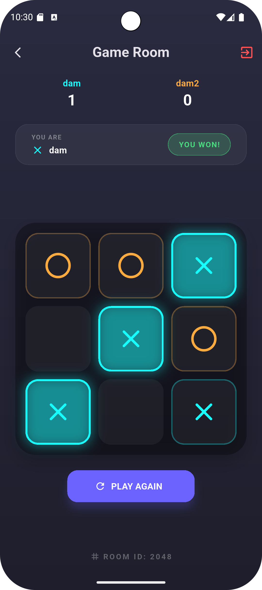

# 🎮 Tic Tac Toe Party - Realtime Multiplayer


**Tic Tac Toe Party** is a modern, real-time multiplayer mobile game built with **Flutter** and **Firebase**. It features a stunning "Neon Dark Mode" glassmorphism UI, instant room creation, live scoreboards, and seamless rematch capabilities.

---

## ✨ Features

* **Real-Time Gameplay:** Instant move synchronization using Cloud Firestore.
* **Multiplayer Rooms:** Create a private room and share the 4-digit code to play with friends anywhere.
* **Modern UI:** Sleek, dark-themed interface with neon accents and glassmorphism effects.
* **Live Scoreboard:** Tracks wins (X vs O) persistently throughout the session.
* **Smart Rematch:** "Play Again" feature that automatically swaps players (X becomes O) for fair play.
* **Rejoin Ability:** Accidentally closed the app? Re-enter the room code to reclaim your spot.
* **Player Status:** Detects when opponents join or disconnect.

---

## 📱 Screenshots

| Home Screen | Game Room | Win State |
|:---:|:---:|:---:|
|  |  |  |

*(Note: Add your actual screenshots to a `screenshots` folder in your repo)*

---

## 🛠 Tech Stack

* **Framework:** [Flutter](https://flutter.dev/)
* **Language:** [Dart](https://dart.dev/)
* **Backend:** [Firebase Cloud Firestore](https://firebase.google.com/products/firestore)
* **State Management:** [GetX](https://pub.dev/packages/get)
* **Icons:** [Flutter Launcher Icons](https://pub.dev/packages/flutter_launcher_icons)

---

## 🚀 Getting Started

Follow these instructions to get a copy of the project up and running on your local machine.

### 1. Prerequisites
Make sure you have the following installed:
* [Flutter SDK](https://docs.flutter.dev/get-started/install)
* [Git](https://git-scm.com/)
* VS Code or Android Studio

### 2. Clone the Repository

```bash
git clone [https://github.com/JhaSourav07/ticTakToe.git](https://github.com/JhaSourav07/ticTakToe.git)
cd tictaktoe

### Firebase Setup Guide (Crucial Step)

Since this app relies on Firebase for real-time data, you must link it to your own Firebase project.

Step 1: Create a Firebase Project
Go to the Firebase Console.

Click Add project.

Name it TicTacToeParty (or whatever you like).

Disable Google Analytics (optional, not needed for this app) and click Create Project.

Step 2: Configure Android
In the Firebase Console dashboard, click the Android Icon (robot).

Android Package Name: Open your project in VS Code, go to android/app/build.gradle and find the applicationId. It is likely com.example.ticktaktoe (or similar). Paste that into Firebase.

Click Register App.

Download the google-services.json file.

Move this file into your project directory: android/app/google-services.json.

Step 3: Configure iOS (Mac Only)
Click Add App -> iOS.

iOS Bundle ID: Open ios/Runner.xcodeproj/project.pbxproj and search for PRODUCT_BUNDLE_IDENTIFIER. Paste that ID into Firebase.

Click Register App.

Download GoogleService-Info.plist.

Move this file into your project directory: ios/Runner/GoogleService-Info.plist.

Step 4: Create the Database
In the Firebase Console left menu, click Build -> Firestore Database.

Click Create Database.

Choose a location (e.g., nam5 (us-central)).

### Important: Choose Start in Test Mode.

Note: This allows anyone to read/write for 30 days. For production, you will need to set up Authentication and stricter rules.

Step 5: Verify Security Rules
Go to the Rules tab in Firestore and ensure it looks like this for development:

```bash
JavaScript
rules_version = '2';
service cloud.firestore {
  match /databases/{database}/documents {
    match /{document=**} {
      allow read, write: if true;
    }
  }
}

### Running the App
Once Firebase is configured, you can run the app on your emulator or physical device.

```bash
# Run on Android/iOS
flutter run

### Security Note
To keep your Firebase project secure:

Do not commit google-services.json or firebase_options.dart to a public GitHub repository. Add them to your .gitignore.

Before publishing to the Play Store/App Store, switch your Firestore Rules to Production Mode and implement Firebase Authentication (e.g., Anonymous Auth) to verify users.

###  Contributing
Contributions are what make the open-source community such an amazing place to learn, inspire, and create. Any contributions you make are greatly appreciated.

Fork the Project

Create your Feature Branch (git checkout -b feature/AmazingFeature)

Commit your Changes (git commit -m 'Add some AmazingFeature')

Push to the Branch (git push origin feature/AmazingFeature)

Open a Pull Request

