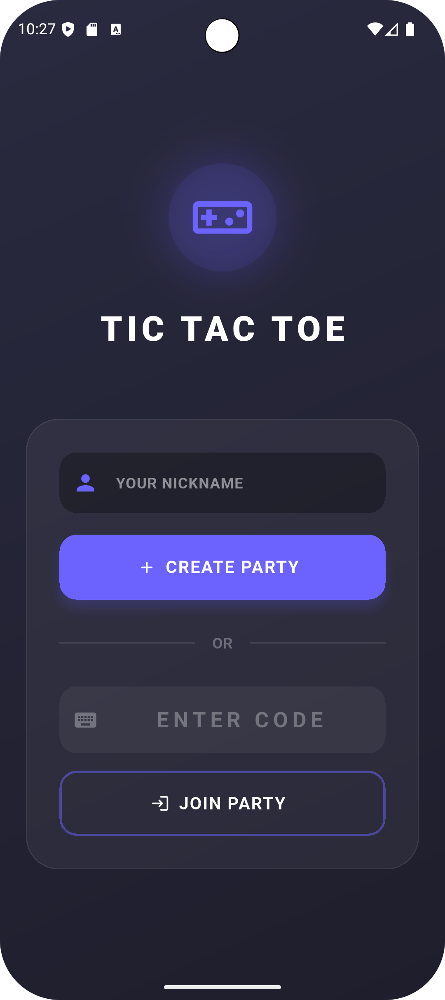
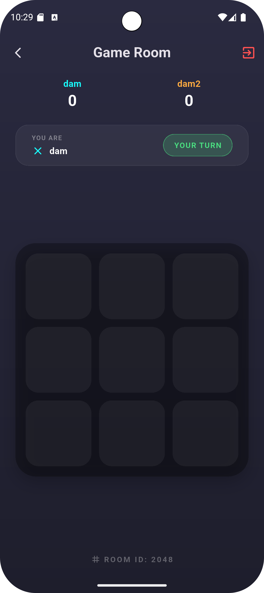
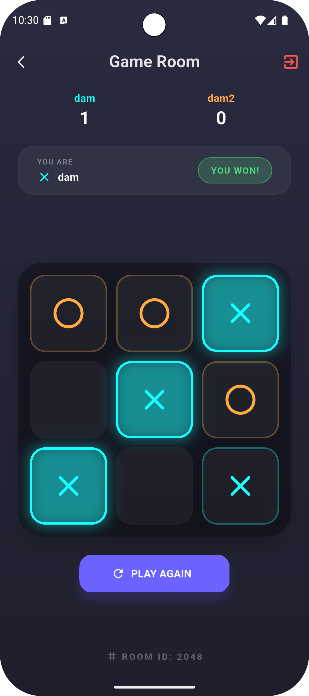

# 🎮 Tic Tac Toe Party - Realtime Multiplayer


**Tic Tac Toe Party** is a modern, real-time multiplayer mobile game built with **Flutter** and **Firebase**. It features a stunning "Neon Dark Mode" glassmorphism UI, instant room creation, live scoreboards, and seamless rematch capabilities.

---

## ✨ Features

- **Real-Time Gameplay:** Instant move synchronization using Cloud Firestore.
- **Multiplayer Rooms:** Create a private room and share the 4-digit code to play with friends anywhere.
- **Modern UI:** Sleek, dark-themed interface with neon accents and glassmorphism effects.
- **Live Scoreboard:** Tracks wins (X vs O) persistently throughout the session.
- **Smart Rematch:** "Play Again" feature that automatically swaps players (X becomes O) for fair play.
- **Rejoin Ability:** Accidentally closed the app? Re-enter the room code to reclaim your spot.
- **Player Status:** Detects when opponents join or disconnect.

---

## 📱 Screenshots

| Home Screen | Game Room | Win State |
|:---:|:---:|:---:|
|  |  |  |

*(Note: Add your actual screenshots to a `screenshots` folder in your repo)*

---

## 🛠 Tech Stack

| Layer | Technology |
|---|---|
| Framework | [Flutter](https://flutter.dev/) |
| Language | [Dart](https://dart.dev/) |
| Backend | [Firebase Cloud Firestore](https://firebase.google.com/products/firestore) |
| State Management | [GetX](https://pub.dev/packages/get) |
| Icons | [Flutter Launcher Icons](https://pub.dev/packages/flutter_launcher_icons) |

---

## 🚀 Getting Started

### Prerequisites

Make sure you have the following installed:
- [Flutter SDK](https://docs.flutter.dev/get-started/install)
- [Git](https://git-scm.com/)
- VS Code or Android Studio

### 1. Clone the Repository

```bash
git clone https://github.com/JhaSourav07/ticTakToe.git
cd tictaktoe
```

### 2. Install Dependencies

```bash
flutter pub get
```

### 3. Set Up Firebase

Follow the full Firebase setup guide below, then run:

```bash
flutter run
```

---

## 🔥 Firebase Setup Guide

This app uses **Firebase Firestore** for real-time multiplayer functionality. You must connect the project to your own Firebase project before running the app.

### Step 1: Create a Firebase Project

1. Go to the [Firebase Console](https://console.firebase.google.com/)
2. Click **Add Project**
3. Name it `TicTacToeParty` (or any name you prefer)
4. (Optional) Disable **Google Analytics**
5. Click **Create Project**

---

### Step 2: Configure Android

1. In the Firebase dashboard, click the **Android icon (🤖)**
2. Find your **Android Package Name** by opening `android/app/build.gradle` and locating:
   ```gradle
   applicationId "com.example.tictactoe"
   ```
3. Paste that value into Firebase and click **Register App**
4. Download `google-services.json` and move it to:
   ```
   android/app/google-services.json
   ```

---

### Step 3: Configure iOS *(Mac Only)*

1. In the Firebase dashboard, click **Add App → iOS**
2. Find your **iOS Bundle ID** by opening `ios/Runner.xcodeproj/project.pbxproj` and searching for `PRODUCT_BUNDLE_IDENTIFIER`
3. Paste that value into Firebase and click **Register App**
4. Download `GoogleService-Info.plist` and move it to:
   ```
   ios/Runner/GoogleService-Info.plist
   ```

---

### Step 4: Create Firestore Database

1. In the Firebase Console, go to **Build → Firestore Database**
2. Click **Create Database**
3. Choose a location (e.g., `nam5 (us-central)`)
4. Select **Start in Test Mode**

> ⚠️ Test Mode allows public read/write access for 30 days. For production, you must configure authentication and secure Firestore rules.

---

### Step 5: Enable Anonymous Authentication

1. In the Firebase Console, go to **Authentication → Sign-in method**
2. Enable **Anonymous** sign-in

---

### Step 6: Set Firestore Security Rules

In the Firebase Console, go to **Firestore Database → Rules** and replace the content with:

```javascript
rules_version = '2';
service cloud.firestore {
  match /databases/{database}/documents {
    match /rooms/{roomId} {
      function isSignedIn() {
        return request.auth != null;
      }

      function myUid() {
        return request.auth.uid;
      }

      function isPlayer() {
        return resource.data.player1Id == myUid() || resource.data.player2Id == myUid();
      }

      allow read: if isSignedIn() && (
        isPlayer() ||
        resource.data.player1Id == '' ||
        resource.data.player2Id == ''
      );

      allow create: if isSignedIn() &&
        request.resource.data.player1Id == myUid() &&
        request.resource.data.player2Id == '' &&
        request.resource.data.turn == myUid() &&
        request.resource.data.board.size() == 9;

      allow update: if isSignedIn() && (
        (
          request.writeFields().hasOnly(['player1Id', 'player1Name']) &&
          resource.data.player1Id == '' &&
          request.resource.data.player1Id == myUid()
        ) ||
        (
          request.writeFields().hasOnly(['player2Id', 'player2Name']) &&
          resource.data.player2Id == '' &&
          request.resource.data.player2Id == myUid()
        ) ||
        (
          request.writeFields().hasOnly(['player1Id']) &&
          resource.data.player1Id == myUid() &&
          request.resource.data.player1Id == myUid()
        ) ||
        (
          request.writeFields().hasOnly(['player2Id']) &&
          resource.data.player2Id == myUid() &&
          request.resource.data.player2Id == myUid()
        ) ||
        (
          request.writeFields().hasOnly(['player1Id']) &&
          resource.data.player1Id == myUid() &&
          request.resource.data.player1Id == ''
        ) ||
        (
          request.writeFields().hasOnly(['player2Id']) &&
          resource.data.player2Id == myUid() &&
          request.resource.data.player2Id == ''
        ) ||
        (
          request.writeFields().hasOnly(['board', 'turn']) &&
          resource.data.turn == myUid() &&
          (resource.data.player1Id == myUid() ? resource.data.player2Id : resource.data.player1Id) != '' &&
          request.resource.data.turn == (
            resource.data.player1Id == myUid()
              ? resource.data.player2Id
              : resource.data.player1Id
          )
        ) ||
        (
          request.writeFields().hasOnly(['winner', 'isGameActive', 'player1Score', 'player2Score', 'winningLine']) &&
          isPlayer()
        ) ||
        (
          request.writeFields().hasOnly(['board', 'turn', 'winner', 'isGameActive', 'winningLine']) &&
          isPlayer() &&
          request.resource.data.player1Id == resource.data.player1Id &&
          request.resource.data.player2Id == resource.data.player2Id
        )
      );
    }
  }
}
```

---

## 🤝 Contributing

Contributions are welcome! 🎉

1. **Fork** the repository
2. Create a new branch:
   ```bash
   git checkout -b feature/your-feature-name
   ```
3. Make your changes and commit:
   ```bash
   git commit -m "Add: short description of your feature"
   ```
4. Push to your branch:
   ```bash
   git push origin feature/your-feature-name
   ```
5. Open a **Pull Request**

### 💡 Contribution Ideas

- Improve UI/UX
- Add sound effects
- Add player authentication
- Improve Firestore security rules
- Add game history
- Add leaderboard support
- Write tests

---

## 🐛 Reporting Issues

If you find a bug or have a feature request:

1. Open an [Issue](https://github.com/JhaSourav07/ticTakToe/issues)
2. Clearly describe the problem
3. Include screenshots if applicable
4. Provide steps to reproduce

---

Thank you for contributing and helping improve TicTacToe Party ❤️
